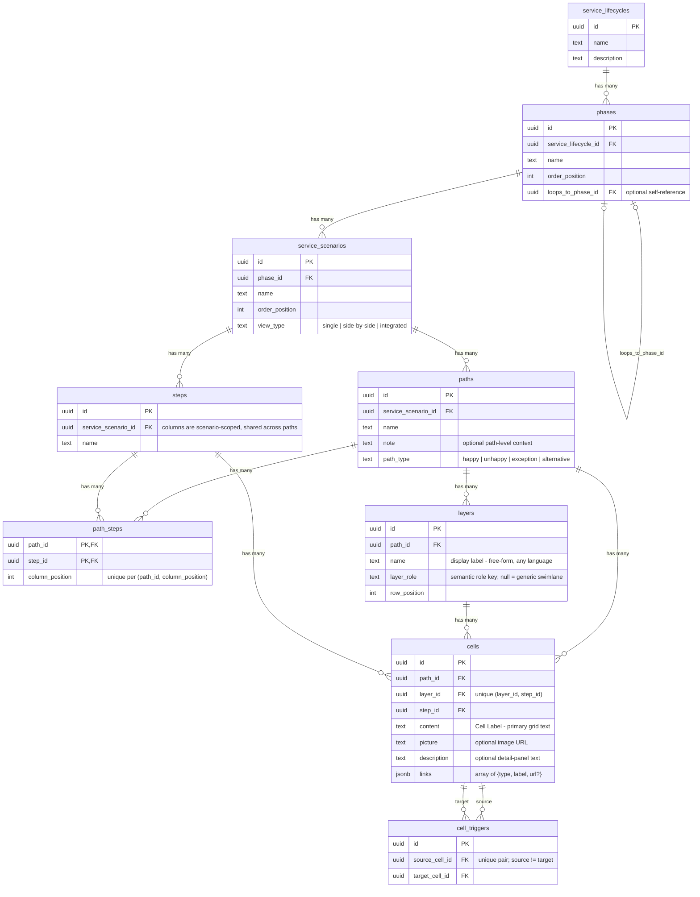

# Agentic Service Blueprinting

An org-agnostic **service blueprint** template: a React + Vite + [shadcn/ui](https://ui.shadcn.com/) frontend and a [Supabase](https://supabase.com/) schema for mapping service journeys as lifecycle → phases → scenarios → path grids (swimlanes × steps → cells, with dependency arrows, comparison views, and print/PDF export).

This repo is also the future home of the **`service-blueprinting` Claude Code plugin** — a skill that ingests, co-creates, translates, imports, and updates blueprints on top of this template. See the plan: [docs/plans/2026-07-16-001-feat-service-blueprint-agent-skill-plan.md](./docs/plans/2026-07-16-001-feat-service-blueprint-agent-skill-plan.md).

## Quickstart (no database needed)

```bash
npm install
npm run dev
```

That's it — with no `VITE_SUPABASE_*` env vars the app runs in **no-DB mode** and renders the bundled sample content: a `Sample Service` scenario with three paths (happy / alternative / exception), 12 swimlanes (canonical + custom `layer_role`s, CJK labels), and 16 steps. The sample is generated by [`scripts/generate_scale_fixture.mjs`](./scripts/generate_scale_fixture.mjs) into both `src/data/scaleFixture.ts` (offline fallback) and `supabase/seed.sql` (database seed).

## With Supabase

```bash
cp .env.example .env
npm run supabase:start       # local stack (Docker)
npm run supabase:reset       # applies migrations + sample seed
npm run dev
```

Copy `API URL` and `anon key` from the CLI output into `.env`. For a hosted project: `supabase link`, `supabase db push`, then `supabase db execute --file supabase/seed.sql --linked`, and set `.env` from **Settings → API**.

> **Exposure note:** all tables carry public `SELECT` policies (read-only anon access). Anything you deploy is publicly readable — don't load client-sensitive content into a public deployment.

## Data model

Full reference: [supabase/DATABASE.md](./supabase/DATABASE.md) · attribute-level source: [docs/erd.mmd](./docs/erd.mmd)



Key semantics:

- **`layers.layer_role`** — rendering is driven by a semantic role key (`customer_actions`, `frontstage_actions`, `backstage_actions`, `frontstage_tech`, `backstage_tech`, `support_systems`, `visual`, `step_visual`), never by the display name, so lane labels are free-form in any language. Custom roles and `null` render as generic swimlanes. Contract: [`src/lib/layerRoles.ts`](./src/lib/layerRoles.ts).
- **Steps are scenario-scoped columns** shared across paths via `path_steps` ordering — see [docs/scenario-steps-design.md](./docs/scenario-steps-design.md).
- **Import order** (enforced by the `cells_validate_path_match` trigger): `paths → steps → path_steps → layers → cells → cell_triggers`.
- **View modes** per scenario: `single`, `side-by-side` (any set of labeled variants — e.g. designed vs. reality), `integrated` (runtime merge).

## Deploy

`netlify.toml` at the repo root carries the build command, `dist/` publish dir, node version, and the SPA redirect (`/* /index.html 200`). Any static host works — the build always produces a plain `dist/`; live-DB mode needs `VITE_SUPABASE_URL` / `VITE_SUPABASE_ANON_KEY` at **build time**.

## Scripts

| Command | Description |
| --- | --- |
| `npm run dev` | Vite dev server |
| `npm run build` | Typecheck + production build |
| `npm run lint` | ESLint |
| `npm run supabase:start` / `stop` / `reset` | Local Supabase stack |
| `npm run supabase:types` / `types:local` | Regenerate `src/types/database.ts` |
| `node scripts/generate_scale_fixture.mjs` | Regenerate the sample content (fallback module + seed) |

## UI

Built with **shadcn/ui** (Tailwind v4). Add components with `npx shadcn@latest add <component>`; theme tokens live in `src/index.css`.

## Repo map

| Path | Purpose |
| --- | --- |
| `src/components/blueprint/` | Blueprint grid, paths, trigger arrows |
| `src/components/editor/` | Canvas/slide editor shell |
| [src/lib/layerRoles.ts](./src/lib/layerRoles.ts) | `layer_role` rendering contract |
| [src/data/blueprintFallbacks.ts](./src/data/blueprintFallbacks.ts) | Offline/no-DB fallback registry (sample content) |
| [supabase/migrations/](./supabase/migrations/) | One consolidated schema migration |
| [supabase/seed.sql](./supabase/seed.sql) | Generated sample seed |
| [supabase/schema.reference.sql](./supabase/schema.reference.sql) | DDL snapshot |
| [docs/generalization-audit.md](./docs/generalization-audit.md) | Record of the template scrub (what was removed from the source instance and why) |
| [docs/plans/](./docs/plans/) | The service-blueprinting skill plan |
