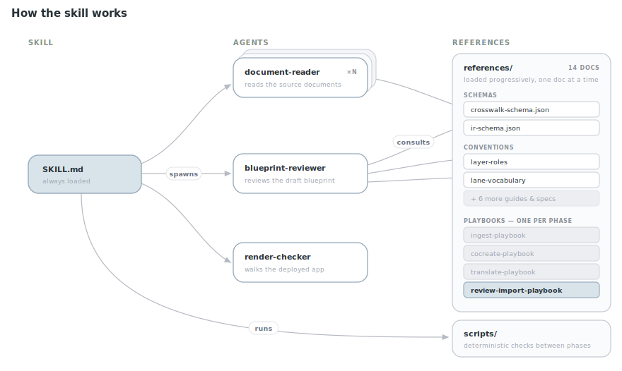
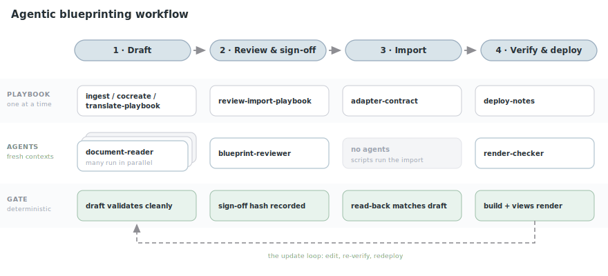
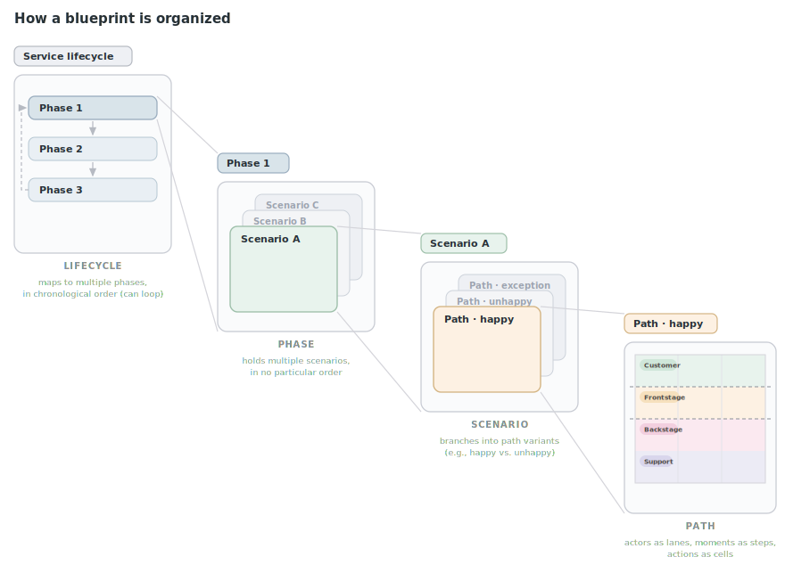
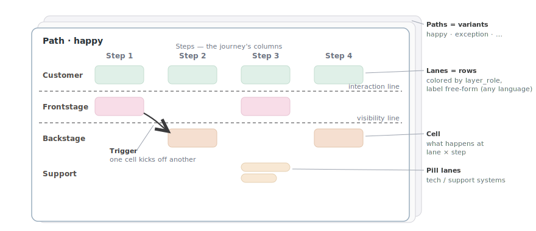

# Agentic Service Blueprinting

Turn a service blueprint from a static artifact into an operational source of truth — structured, queryable data that agents consult continuously. **It stops being a poster and becomes a database.**

This repo is that idea, working end to end — two things in one:

1. **The `service-blueprinting` Claude Code plugin** — a skill that ingests service docs, co-creates with stakeholders, translates foreign diagrams (FigJam / spreadsheets / Shostack layouts), validates, and imports blueprints end-to-end, with adversarial review and hash-bound sign-off gates along the way.
2. **An org-agnostic frontend + backend template** the skill deploys onto — React + Vite + [shadcn/ui](https://ui.shadcn.com/) grid renderer and a [Supabase](https://supabase.com/) schema, with dependency arrows, comparison views, and print/PDF export.

## Why a queryable blueprint

Service blueprints have traditionally been strategic artifacts rather than day-to-day reference tools. Partly because they are expensive to use: interpreting one takes facilitation, workshops, and built-up context, so teams engage with them occasionally, not daily. Agents change that constraint — an agent can consult the blueprint continuously, grounding each recommendation in the full journey and checking proposed changes against the wider service, without adding work for the team.

What that buys you:

- **It gives agents the service context they are otherwise missing.** Most context-engineering approaches hand the agent piles of documents that each describe part of the product. The blueprint gives it a coherent model of the whole service: the user journey, frontstage and backstage activity, supporting systems, and the relationships between them.
- **It improves everyday product work.** With that context, an agent writes clearer PRDs, scopes projects more precisely, locates where a change sits within the service, and reasons about downstream effects.
- **It creates a shared lens for people and agents.** The blueprint does more than add facts — it pushes the agent to reason through a service-design frame, and grounds the team's own thinking in that same frame.
- **It makes the blueprint continuously used.** Because the agent depends on it daily, the team has a practical reason to keep it accurate. Operational use strengthens its value as a strategic artifact rather than replacing it.

## See it live

- **[PLUS tutoring blueprint](https://uno-blueprint.netlify.app)** — the in-house service blueprint this template was generalized from: a five-phase tutoring lifecycle with side-by-side path comparisons, trigger arrows, and cell detail panels. Click any phase, then flip paths.

Demos of the blueprint in use (recordings coming soon):

- *Agent in the IDE* — Claude Code queries the blueprint while scoping a feature: locating the moment a change touches, tracing downstream effects. *(placeholder)*
- *Inline agent* — a chat agent answers service questions ("where does refund approval happen?") with cell-level citations. *(placeholder)*
- *Human browsing* — a teammate walks phases, flips path variants, and reads cell detail panels in the deployed app. *(placeholder)*

## The skill

### What it does

Install the repo as a Claude Code plugin, then ask Claude to map a service — "turn our FigJam service map into a deployed blueprint", "blueprint how our support process works". The skill routes by what exists: nothing → co-create from conversation; docs → ingest with per-cell provenance; a foreign structured diagram → translate via crosswalk; an existing workspace → resume/update.

The pipeline in one line:

**sources → IR** (JSON, validated) **→ preview + adversarial review → per-scenario sign-off → import** (no-DB fallback or live Supabase) **→ verify + deploy**

### How it works



*One always-loaded **skill** ([SKILL.md](./skills/blueprint/SKILL.md)) routes the work: it pulls **one playbook per phase** from [references/](./references/) into the main context, and spawns **fresh-context agents** for the heavy reading — `document-reader` over the sources, `blueprint-reviewer` over the draft IR, `render-checker` over the deployed app. Each agent consults just the reference docs its job needs and returns a thin summary.*

### The workflow



*Each phase swaps in its own playbook, spawns only the agents it needs, and ends at a deterministic gate checked against `blueprint-workspace.json` — never "looks done". The loop back is the point: a blueprint touched once is a failure; touched monthly, it stays the operational source of truth.*

## The blueprint model

### How a blueprint is organized



*Read left to right — each panel zooms one level in: a **lifecycle** holds ordered **phases** (which can loop back via `loops_to_phase_id`); a phase holds **scenarios**; a scenario holds **path** variants; each path is a lanes × steps grid of **cells**.*

### Inside a single path



*Lanes are rows — one actor each, colored by semantic `layer_role` (labels are free-form, any language). Steps are columns — time runs left to right. A **cell** is what one actor does at one moment; **triggers** are "this cell sets off that one" arrows between cells. The **interaction** and **visibility** lines are derived from roles, and the sheets stacked behind are the scenario's other **paths** (tech/support lanes render their cells as pills in the app).*

### Key semantics

- **`layers.layer_role`** — rendering (colors, pill cells, divider lines) is driven by a semantic role key (`customer_actions`, `frontstage_actions`, `backstage_actions`, `frontstage_tech`, `backstage_tech`, `support_systems`, `visual`, `step_visual`), never by the display name — lane labels are free-form in any language. Custom roles and `null` render as generic swimlanes. Contract: [`src/lib/layerRoles.ts`](./src/lib/layerRoles.ts).
- **Steps are scenario-scoped columns** shared across paths via `path_steps` ordering — see [docs/scenario-steps-design.md](./docs/scenario-steps-design.md).
- **Import order** (enforced by the `cells_validate_path_match` trigger): `paths → steps → path_steps → layers → cells → cell_triggers`.
- **View modes** per scenario: `single`, `side-by-side` (any set of labeled variants — e.g. designed vs. reality), `integrated` (runtime merge).

Full detail when you need it: [supabase/DATABASE.md](./supabase/DATABASE.md) (column reference) · [docs/erd.mmd](./docs/erd.mmd) (attribute-level ERD).

## Get set up

Hand this section to your agent — it can run all of it. Each subsection also works as manual steps.

### Run locally

No database needed — this renders the bundled sample blueprint so you can see the frontend working before wiring anything up:

```bash
npm install
npm run dev
```

With no `VITE_SUPABASE_*` env vars the app runs in **no-DB mode** and renders the bundled sample content — generated by [`scripts/generate_scale_fixture.mjs`](./scripts/generate_scale_fixture.mjs) into both `src/data/scaleFixture.ts` (offline fallback) and `supabase/seed.sql` (database seed).

### Add a database

```bash
cp .env.example .env
npm run supabase:start       # local stack (Docker)
npm run supabase:reset       # applies migrations + sample seed
npm run dev
```

Copy `API URL` and `anon key` from the CLI output into `.env`. For a hosted project: `supabase link`, `supabase db push`, then `supabase db execute --file supabase/seed.sql --linked`, and set `.env` from **Settings → API**.

> **Exposure note:** all tables carry public `SELECT` policies (read-only anon access). Anything you deploy is publicly readable — don't load client-sensitive content into a public deployment.

### Deploy

`netlify.toml` at the repo root carries the build command, `dist/` publish dir, node version, and the SPA redirect (`/* /index.html 200`). Any static host works — the build always produces a plain `dist/`; live-DB mode needs `VITE_SUPABASE_URL` / `VITE_SUPABASE_ANON_KEY` at **build time**. Blueprint-specific deploy gotchas: [references/deploy-notes.md](./references/deploy-notes.md).

### Connect your agents

- **In the IDE** — install this repo as a Claude Code plugin (manifest: [.claude-plugin/plugin.json](./.claude-plugin/plugin.json)). That loads the skill, agents, and hooks: Claude can then build, review, import, and update blueprints in your workspace.
- **Everywhere else (Slack, claude.ai, any MCP-capable agent)** — the deployed blueprint is a Supabase project, so any agent with a [Supabase MCP](https://supabase.com/docs/guides/getting-started/mcp) connection can query it read-only with the anon key. Point the MCP server at your project and the agent can answer service questions with cell-level precision — no plugin required.

## Reference

### Scripts

| Command | Description |
| --- | --- |
| `npm run dev` | Vite dev server |
| `npm run build` | Typecheck + production build |
| `npm run lint` | ESLint |
| `npm run supabase:start` / `stop` / `reset` | Local Supabase stack |
| `npm run supabase:types` / `types:local` | Regenerate `src/types/database.ts` |
| `node scripts/generate_scale_fixture.mjs` | Regenerate the sample content (fallback module + seed) |
| `python3 scripts/validate_ir.py <ir.json>` | Validate a blueprint IR (stdlib-only) |
| `python3 scripts/generate_fallbacks.py <ir.json> --locale <tag> --register` | IR → no-DB data module + offline nav |
| `python3 scripts/generate_seed_sql.py <ir.json> --locale <tag>` | IR → transactional Supabase seed |
| `python3 scripts/compute_signoff_hash.py <ir.json>` | Per-scenario sign-off content hashes |
| `bash scripts/tests/run_tests.sh` | Round-trip test suite for the IR pipeline |

### Repo map

| Path | Purpose |
| --- | --- |
| [.claude-plugin/plugin.json](./.claude-plugin/plugin.json) | Claude Code plugin manifest — this is what makes the repo installable as a plugin |
| [skills/blueprint/SKILL.md](./skills/blueprint/SKILL.md) | The skill entry point: routing, hard rules, phase exit conditions |
| [agents/](./agents/) | Subagents: `document-reader`, `blueprint-reviewer` (adversarial pre-sign-off review), `render-checker` |
| [references/](./references/) | Phase playbooks, IR + crosswalk schemas, layer-role & lane vocabularies, adapter contract, workspace state spec |
| [scripts/](./scripts/) | IR pipeline: validator, fallback + seed generators, sign-off hasher, tests |
| [hooks/](./hooks/) | Session status, IR auto-validation on edit, service-role secret guard |
| `src/components/blueprint/` | Blueprint grid, paths, trigger arrows (shadcn/ui + Tailwind v4; theme tokens in `src/index.css`) |
| `src/components/editor/` | Canvas/slide editor shell |
| [src/lib/layerRoles.ts](./src/lib/layerRoles.ts) | `layer_role` rendering contract |
| [src/data/blueprintFallbacks.ts](./src/data/blueprintFallbacks.ts) | Offline/no-DB fallback registry (sample content) |
| [supabase/migrations/](./supabase/migrations/) | One consolidated schema migration |
| [supabase/seed.sql](./supabase/seed.sql) | Generated sample seed |
| [supabase/schema.reference.sql](./supabase/schema.reference.sql) | DDL snapshot |
| [docs/](./docs/) | ERD, data-model overview diagram, design notes, plans |
