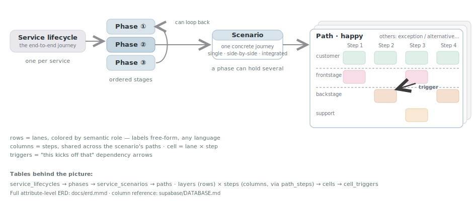

# Agentic Service Blueprinting

Map how a service actually works — as an interactive, navigable **service blueprint** — and let an agent do the heavy lifting.

This repo is two things in one:

1. **The `service-blueprinting` Claude Code plugin** — a skill that ingests service docs, co-creates with stakeholders, translates foreign diagrams (FigJam / spreadsheets / Shostack layouts), validates, and imports blueprints end-to-end, with adversarial review and hash-bound sign-off gates along the way.
2. **An org-agnostic frontend + backend template** the skill deploys onto — React + Vite + [shadcn/ui](https://ui.shadcn.com/) grid renderer and a [Supabase](https://supabase.com/) schema, with dependency arrows, comparison views, and print/PDF export.

## See it live

- **[PLUS tutoring blueprint](https://uno-blueprint.netlify.app)** — the in-house service blueprint this template was generalized from: a five-phase tutoring lifecycle with side-by-side path comparisons, trigger arrows, and cell detail panels. Click any phase, then flip paths.
- **Local sample in 10 seconds** — the Quickstart below renders a bundled bilingual sample (3 paths × 12 lanes × 16 steps) with zero setup.

## Quickstart (no database needed)

```bash
npm install
npm run dev
```

With no `VITE_SUPABASE_*` env vars the app runs in **no-DB mode** and renders the bundled sample content — generated by [`scripts/generate_scale_fixture.mjs`](./scripts/generate_scale_fixture.mjs) into both `src/data/scaleFixture.ts` (offline fallback) and `supabase/seed.sql` (database seed).

## Using the skill

Install the repo as a Claude Code plugin (manifest: [.claude-plugin/plugin.json](./.claude-plugin/plugin.json)), then ask Claude to map a service — "turn our FigJam service map into a deployed blueprint", "blueprint how our support process works". The skill routes by what exists: nothing → co-create; docs → ingest with per-cell provenance; a foreign structured diagram → translate via crosswalk; an existing workspace → resume/update.

The pipeline in one line:

**sources → IR** (JSON, validated) **→ preview + adversarial review → per-scenario sign-off → import** (no-DB fallback or live Supabase) **→ verify + deploy**

Entry point: [skills/blueprint/SKILL.md](./skills/blueprint/SKILL.md). Phase playbooks and contracts live in [references/](./references/); the IR pipeline scripts in [scripts/](./scripts/).

## Data model

One picture instead of an ERD — how the tables map onto what you see:



Key semantics:

- **`layers.layer_role`** — rendering (colors, pill cells, divider lines) is driven by a semantic role key (`customer_actions`, `frontstage_actions`, `backstage_actions`, `frontstage_tech`, `backstage_tech`, `support_systems`, `visual`, `step_visual`), never by the display name — lane labels are free-form in any language. Custom roles and `null` render as generic swimlanes. Contract: [`src/lib/layerRoles.ts`](./src/lib/layerRoles.ts).
- **Steps are scenario-scoped columns** shared across paths via `path_steps` ordering — see [docs/scenario-steps-design.md](./docs/scenario-steps-design.md).
- **Import order** (enforced by the `cells_validate_path_match` trigger): `paths → steps → path_steps → layers → cells → cell_triggers`.
- **View modes** per scenario: `single`, `side-by-side` (any set of labeled variants — e.g. designed vs. reality), `integrated` (runtime merge).

Full detail when you need it: [supabase/DATABASE.md](./supabase/DATABASE.md) (column reference) · [docs/erd.mmd](./docs/erd.mmd) (attribute-level ERD).

## With Supabase

```bash
cp .env.example .env
npm run supabase:start       # local stack (Docker)
npm run supabase:reset       # applies migrations + sample seed
npm run dev
```

Copy `API URL` and `anon key` from the CLI output into `.env`. For a hosted project: `supabase link`, `supabase db push`, then `supabase db execute --file supabase/seed.sql --linked`, and set `.env` from **Settings → API**.

> **Exposure note:** all tables carry public `SELECT` policies (read-only anon access). Anything you deploy is publicly readable — don't load client-sensitive content into a public deployment.

## Deploy

`netlify.toml` at the repo root carries the build command, `dist/` publish dir, node version, and the SPA redirect (`/* /index.html 200`). Any static host works — the build always produces a plain `dist/`; live-DB mode needs `VITE_SUPABASE_URL` / `VITE_SUPABASE_ANON_KEY` at **build time**. Blueprint-specific deploy gotchas: [references/deploy-notes.md](./references/deploy-notes.md).

## Scripts

| Command | Description |
| --- | --- |
| `npm run dev` | Vite dev server |
| `npm run build` | Typecheck + production build |
| `npm run lint` | ESLint |
| `npm run supabase:start` / `stop` / `reset` | Local Supabase stack |
| `npm run supabase:types` / `types:local` | Regenerate `src/types/database.ts` |
| `node scripts/generate_scale_fixture.mjs` | Regenerate the sample content (fallback module + seed) |
| `python3 scripts/validate_ir.py <ir.json>` | Validate a blueprint IR (stdlib-only) |
| `python3 scripts/generate_fallbacks.py <ir.json> --locale <tag> --register` | IR → no-DB data module + offline nav |
| `python3 scripts/generate_seed_sql.py <ir.json> --locale <tag>` | IR → transactional Supabase seed |
| `python3 scripts/compute_signoff_hash.py <ir.json>` | Per-scenario sign-off content hashes |
| `bash scripts/tests/run_tests.sh` | Round-trip test suite for the IR pipeline |

## UI

Built with **shadcn/ui** (Tailwind v4). Add components with `npx shadcn@latest add <component>`; theme tokens live in `src/index.css`.

## Repo map

| Path | Purpose |
| --- | --- |
| [.claude-plugin/plugin.json](./.claude-plugin/plugin.json) | Claude Code plugin manifest — this is what makes the repo installable as a plugin |
| [skills/blueprint/SKILL.md](./skills/blueprint/SKILL.md) | The skill entry point: routing, hard rules, phase exit conditions |
| [agents/](./agents/) | Subagents: `document-reader`, `blueprint-reviewer` (adversarial pre-sign-off review), `render-checker` |
| [references/](./references/) | Phase playbooks, IR + crosswalk schemas, layer-role & lane vocabularies, adapter contract, workspace state spec |
| [scripts/](./scripts/) | IR pipeline: validator, fallback + seed generators, sign-off hasher, tests |
| [hooks/](./hooks/) | Session status, IR auto-validation on edit, service-role secret guard |
| `src/components/blueprint/` | Blueprint grid, paths, trigger arrows |
| `src/components/editor/` | Canvas/slide editor shell |
| [src/lib/layerRoles.ts](./src/lib/layerRoles.ts) | `layer_role` rendering contract |
| [src/data/blueprintFallbacks.ts](./src/data/blueprintFallbacks.ts) | Offline/no-DB fallback registry (sample content) |
| [supabase/migrations/](./supabase/migrations/) | One consolidated schema migration |
| [supabase/seed.sql](./supabase/seed.sql) | Generated sample seed |
| [supabase/schema.reference.sql](./supabase/schema.reference.sql) | DDL snapshot |
| [docs/](./docs/) | ERD, data-model overview diagram, design notes, plans |
