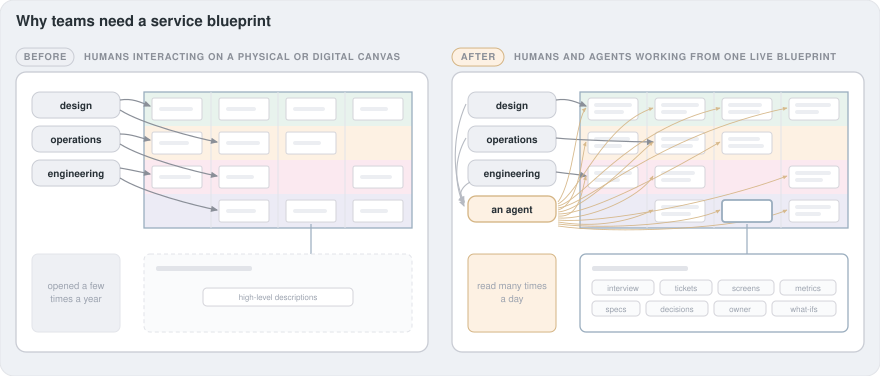
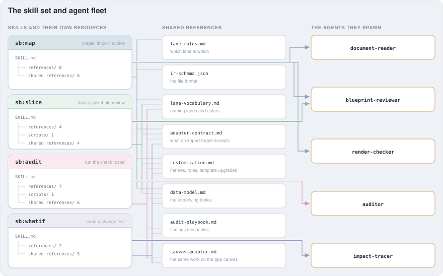
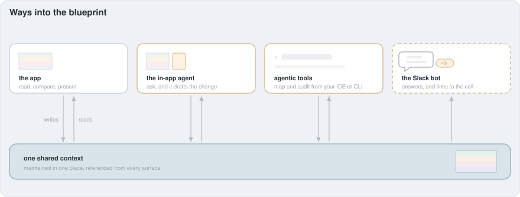

# Agentic Service Blueprinting

Turn a service blueprint from a static artifact into an operational source of truth: structured, queryable data that agents consult continuously. **It stops being a poster and becomes a database.**

This repo is that idea, working end to end — two things in one:

1. **The `sb` Claude Code plugin** — four skills, in the order a team meets them. `sb:map` builds a blueprint from whatever you have: documents, a working session, or a diagram exported from somewhere else. `sb:audit` runs a roster of consistency checks over it. `sb:whatif` traces a proposed change before anyone commits to it. `sb:slice` takes the view one audience needs out of it.
2. **An org-agnostic frontend and backend template** that `sb:map` deploys onto — React + Vite + [shadcn/ui](https://ui.shadcn.com/) grid renderer and a [Supabase](https://supabase.com/) schema, with dependency arrows, comparison views, and print/PDF export.

## Why a queryable blueprint



Service blueprints have traditionally been strategic artifacts rather than day-to-day reference tools. Partly because they are expensive to use: interpreting one takes facilitation, workshops, and built-up context, so teams engage with them occasionally, not daily. Agents change that constraint. An agent can consult the blueprint continuously, grounding each recommendation in the full journey and checking proposed changes against the wider service, without adding work for the team.

What that buys you:

- **It gives agents the service context they are otherwise missing.** Most context-engineering approaches hand the agent piles of documents that each describe part of the product. The blueprint gives it a coherent model of the whole service: the user journey, frontstage and backstage activity, supporting systems, and the relationships between them.
- **It improves everyday product work.** With that context, an agent writes clearer PRDs, scopes projects more precisely, locates where a change sits within the service, and reasons about downstream effects.
- **It creates a shared lens for people and agents.** The blueprint does more than add facts — it pushes the agent to reason through a service-design frame, and grounds the team's own thinking in that same frame.
- **It makes the blueprint continuously used.** Because the agent depends on it daily, the team has a practical reason to keep it accurate. Operational use strengthens its value as a strategic artifact rather than replacing it.

## See it live

- **[An example deployment](https://uno-blueprint.netlify.app)** — the in-house service this template was generalized from, running the stock renderer: six phases, side-by-side path comparisons, trigger arrows, and cell detail panels. Click any phase, then flip between paths. (An example, not a dependency — nothing in this repo needs it.)

Demos of the blueprint in use (recordings coming soon):

- *Agent in the IDE* — Claude Code scopes a feature against the blueprint: finding the moment the change lands, then tracing what it reaches. *(placeholder)*
- *Inline agent* — a chat agent answers a service question ("where does approval happen?") and cites the cells it answered from. *(placeholder)*
- *Reading it as a person* — walking the phases, flipping path variants, opening cell detail panels. *(placeholder)*

## The plugin

### What it does

Install the repo as a Claude Code plugin, then ask Claude to map a service — "turn our FigJam service map into a deployed blueprint", "blueprint how our support process works". `sb:map` routes by what exists: nothing → co-create from conversation; docs → ingest with per-cell provenance; a foreign structured diagram → translate via crosswalk; an existing workspace → resume/update.

The pipeline in one line:

**sources → one validated blueprint file → preview + adversarial review → per-scenario sign-off → import** (no-database fallback or live Supabase) **→ verify + deploy**

### How it works



*Four skills, each carrying its own playbooks and scripts and linking only the shared references its task needs. The heavy reading happens in **fresh-context agents** — `document-reader` over the sources, `blueprint-reviewer` over the draft, `auditor` one check at a time, `impact-tracer` down the dependency graph — each returning a thin summary rather than its raw material. Every phase ends at a deterministic gate, never at "looks done".*

### The four skills

| Skill | What it is for | Where it ends |
| --- | --- | --- |
| [`sb:map`](./skills/map/SKILL.md) | create a blueprint, import documents, translate a foreign diagram, resume an existing workspace | a validated `blueprint/blueprint.json`, signed off per scenario |
| [`sb:audit`](./skills/audit/SKILL.md) | run the check roster over a blueprint | findings you triage, nothing changed for you |
| [`sb:whatif`](./skills/whatif/SKILL.md) | trace a proposed change before anyone commits to it | the cells it would reach, on a copy |
| [`sb:slice`](./skills/slice/SKILL.md) | take a stakeholder view out of the blueprint: `journey`, `step`, `lane`, `cell`, `custom` | a slice document that still points at the cells it quotes |

Each is walked, with its own figure, in [guide/03 — The plugin](./docs/guide/03-the-plugin.md).

## Where the blueprint is used



The app is where people read, compare, and present. The in-app agent drafts changes in place. Your agentic tools reach the same rows from your IDE or CLI. A chat bot on top answers questions and links back to the exact cell. All four work from one shared context lane, so what any of them reads is what the others wrote. Who may do what follows from the account each one uses: see [guide/04 — Operations](./docs/guide/04-operations.md).

## The blueprint model

### How a blueprint is organized


*Read left to right — each panel zooms one level in: a **service** holds ordered **phases** (which can loop back via `loops_to_phase_id`); a phase holds **scenarios**; a scenario holds **path** variants; each path is a lanes × steps grid of **cells**.*

### Inside a single path


*Lanes are rows — one actor each, colored by semantic `lane_role` (labels are free-form, any language). Steps are columns — time runs left to right. A **cell** is what one actor does at one moment; **triggers** are "this cell sets off that one" arrows between cells. The **interaction** and **visibility** lines are derived from roles, and the sheets stacked behind are the scenario's other **paths** (tech/support lanes render their cells as pills in the app).*

*Two levels down — what a single cell holds, and how a slice is taken out of the blueprint — are in [guide/01 — The blueprint model](./docs/guide/01-the-blueprint-model.md).*

### Key semantics

- **`lanes.lane_role`** — rendering (colors, pill cells, divider lines) is driven by a semantic role key (`customer_actions`, `frontstage_actions`, `backstage_actions`, `frontstage_tech`, `backstage_tech`, `support_systems`, `visual`, `step_visual`), never by the display name — lane labels are free-form in any language. Custom roles and `null` render as generic swimlanes. Contract: [`src/lib/laneRoles.ts`](./src/lib/laneRoles.ts).
- **Steps are scenario-scoped columns** shared across paths via `path_steps` ordering — see [references/data-model.md](./references/data-model.md).
- **Import order** (enforced by the `cells_validate_path_match` trigger): `paths → steps → path_steps → lanes → cells → cell_dependencies`.
- **View modes** per scenario: `single`, `side-by-side` (any set of labeled variants — e.g. designed vs. reality), `integrated` (runtime merge).

Full detail when you need it: [supabase/DATABASE.md](./supabase/DATABASE.md) (column reference) · [docs/erd.mmd](./docs/erd.mmd) (attribute-level ERD).

## Get set up

Hand this section to your agent — it can run all of it. Each subsection also works as manual steps.

### Run locally

No database needed — this renders the bundled sample blueprint so you can see the frontend working before wiring anything up:

```bash
npm install
npm run dev
```

With no `VITE_SUPABASE_*` env vars the app runs in **no-DB mode** and renders the bundled sample content — generated by [`scripts/generate_sample_blueprint.mjs`](./scripts/generate_sample_blueprint.mjs) into both `src/data/sampleBlueprint.ts` (offline fallback) and `supabase/seed.sql` (database seed).

### Add a database

```bash
cp .env.example .env
npm run supabase:start       # local stack (Docker)
npm run supabase:reset       # applies migrations + sample seed
npm run dev
```

Copy `API URL` and `anon key` from the CLI output into `.env`. For a hosted project: `supabase link`, `supabase db push`, then `supabase db query --file supabase/seed.sql --linked`, and set `.env` from **Settings → API**.

Then `npm run check:target` — it asks the database which schema it carries. Run it once: the app falls back to bundled content when it cannot reach a project, so "the page renders" does not mean the migration ran.

> **Exposure note:** all tables carry public `SELECT` policies (read-only anon access). Anything you deploy is publicly readable — don't load client-sensitive content into a public deployment.

### Bring your own backend

Supabase-native, backend-portable. The app and the skills run Supabase out of the box, and Supabase is one conformant recipe rather than the requirement.

**What the app actually needs** is the repository interfaces in [`src/lib/backend/ports.ts`](./src/lib/backend/ports.ts): domain operations like `getBlueprint(pathId)`, each declaring whether it reads, is atomic, or converges on re-run. Any store that answers them can serve this app.

**What decides whether yours does** is [`src/lib/backend/conformance.ts`](./src/lib/backend/conformance.ts) — a suite you run from your own runner against your own store. It has two levels: **Transactional**, where atomic operations are all-or-nothing, and **Idempotent**, where they may tear provided re-running converges and a repair pass can resolve what tore. The second level is why a store with no transactions at all can still serve this correctly.

**What you get to copy**: the portable schema ([supabase/schema.reference.sql](./supabase/schema.reference.sql) + [docs/erd.mmd](./docs/erd.mmd)), checked in CI against a stock Postgres; the normative spec in [references/adapter-contract.md](./references/adapter-contract.md); and two working implementations of the interfaces to read.

**What we don't provide** — stated as a boundary rather than a list of apologies, so you know where your work starts:

- **No auth beyond the anon / authenticated split.** The identity port asks one question — what tier is this session — and leaves how you answer it to you. Supabase Auth is the shipped recipe, not the requirement.
- **No multi-tenancy.** One blueprint workspace per database. There is no tenant column, and RLS does not scope by one.
- **No backup or restore.** Your host's problem, and the reason `supabase/migrations/` is append-only: an undo is a new migration.
- **No migration ops beyond the shipped chain.** `db push` and `db reset` are supported; anything past that — branching, squashing, multi-environment promotion — is yours. The one operational failure we do own is desync, with a runbook: [supabase/DATABASE.md § Migration desync](./supabase/DATABASE.md).
- **No adapter for your backend, and no hosting.**

**What answers "is it actually wired up"**: `npm run check:target` asks the live database which schema it carries and tells you whether it was never migrated, is stale, or is fine — [supabase/DATABASE.md § Did the migration run](./supabase/DATABASE.md). Worth running once: without a configured project the app falls back to bundled content and renders perfectly, so a misconfigured target looks exactly like a working one.

**What you start from**: `supabase/seed.sql` is the **META-BLUEPRINT** — the service blueprint of this template itself, not filler. One generator emits it and the no-DB fallback module from the same source, so both adapters serve the same content. Replace it with your own service; until then it doubles as the documentation.

### Deploy

`netlify.toml` at the repo root carries the build command, `dist/` publish dir, node version, and the SPA redirect (`/* /index.html 200`). Any static host works — the build always produces a plain `dist/`; live-DB mode needs `VITE_SUPABASE_URL` / `VITE_SUPABASE_ANON_KEY` at **build time**. Blueprint-specific deploy gotchas: [skills/map/references/deploy-notes.md](./skills/map/references/deploy-notes.md).

### Connect your agents

- **In the IDE** — install this repo as a Claude Code plugin (manifest: [.claude-plugin/plugin.json](./.claude-plugin/plugin.json)). That loads the four skills, five agents, and the hooks: Claude can then build, review, import, and update blueprints in your workspace.
- **Everywhere else (a Slack bot, an assistant, any agent you run)** — a deployed blueprint publishes its rows for reading, so an agent holding the anon key can query them and answer with links back to individual cells. The in-house proof case is a Slack bot that does exactly this. What a backend has to satisfy to work this way is the adapter contract: [references/adapter-contract.md](./references/adapter-contract.md), walked in [guide/03](./docs/guide/03-the-plugin.md).

## Reference

### Scripts

| Command | Description |
| --- | --- |
| `npm run dev` | Vite dev server |
| `npm run build` | Typecheck + production build |
| `npm run lint` | ESLint |
| `npm run supabase:start` / `stop` / `reset` | Local Supabase stack |
| `npm run supabase:types` / `types:local` | Regenerate `src/types/database.ts` |
| `node scripts/generate_sample_blueprint.mjs` | Regenerate the sample content (fallback module + seed) |
| `python3 scripts/validate_ir.py <blueprint.json>` | Validate a blueprint file (stdlib-only) |
| `python3 scripts/generate_fallbacks.py <blueprint.json> --locale <tag> --register` | blueprint → no-database data module + offline nav |
| `python3 scripts/generate_seed_sql.py <blueprint.json> --locale <tag>` | blueprint → transactional Supabase seed |
| `python3 scripts/compute_signoff_hash.py <blueprint.json>` | Per-scenario sign-off content hashes |
| `python3 skills/audit/scripts/audit_tools.py` | Helpers the audit checks run on |
| `python3 skills/slice/scripts/slice_tools.py` | Helpers for composing and validating a slice |
| `npm run check:target` | Ask the configured database which schema it carries |
| `npm test` | Vitest suite for the app |
| `bash scripts/tests/run_tests.sh` | Round-trip test suite for the blueprint pipeline |

### Repo map

| Path | Purpose |
| --- | --- |
| [.claude-plugin/plugin.json](./.claude-plugin/plugin.json) | Claude Code plugin manifest — this is what makes the repo installable as a plugin |
| [skills/](./skills/) | Four skills, one directory each (`map`, `slice`, `audit`, `whatif`): `SKILL.md` entry point plus that skill's own `references/` (playbooks, schemas, check docs) and `scripts/` |
| [agents/](./agents/) | Five subagents: `document-reader`, `blueprint-reviewer` (adversarial pre-sign-off review), `render-checker`, `auditor` (one check at a time, blind to the others), `impact-tracer` (walks the dependency graph) |
| [references/](./references/) | Shared core every skill uses: data model, blueprint schema, adapter contract, canvas adapter, lane-role & lane vocabularies, customization, audit playbook |
| [scripts/](./scripts/) | Shared blueprint pipeline: validator, fallback + seed generators, sign-off hasher, tests |
| [hooks/](./hooks/) | Session status, blueprint auto-validation on edit, service-role secret guard |
| `src/components/blueprint/` | Blueprint grid, paths, trigger arrows (shadcn/ui + Tailwind v4; theme tokens in `src/styles/tokens.css`) |
| `src/components/editor/` | Canvas/slide editor shell |
| [src/lib/laneRoles.ts](./src/lib/laneRoles.ts) | `lane_role` rendering contract |
| [src/data/blueprintFallbacks.ts](./src/data/blueprintFallbacks.ts) | Offline/no-DB fallback registry (sample content) |
| [supabase/migrations/](./supabase/migrations/) | Schema migrations — base template plus the authoring and agent-surface lanes |
| [supabase/seed.sql](./supabase/seed.sql) | Generated sample seed |
| [supabase/schema.reference.sql](./supabase/schema.reference.sql) | DDL snapshot |
| [docs/guide/](./docs/guide/) | The four guides: the model, using it, the plugin, operations |
| [docs/assets/](./docs/assets/) | Every figure in this README and the guides |
| [docs/erd.mmd](./docs/erd.mmd) | Attribute-level ERD |

## Going deeper

| Guide | Who it is for | What it answers |
| --- | --- | --- |
| [01 — The blueprint model](./docs/guide/01-the-blueprint-model.md) | anyone reading or authoring a blueprint | what exactly am I looking at? |
| [02 — Using it in practice](./docs/guide/02-using-it-in-practice.md) | the designer or PM deciding how this fits their week | what do I actually do with it? |
| [03 — The plugin](./docs/guide/03-the-plugin.md) | the adopter installing it, the engineer extending it | how does the machinery work, and what lands on my disk? |
| [04 — Operations](./docs/guide/04-operations.md) | whoever runs it | who may do what, and what happens when it changes? |
