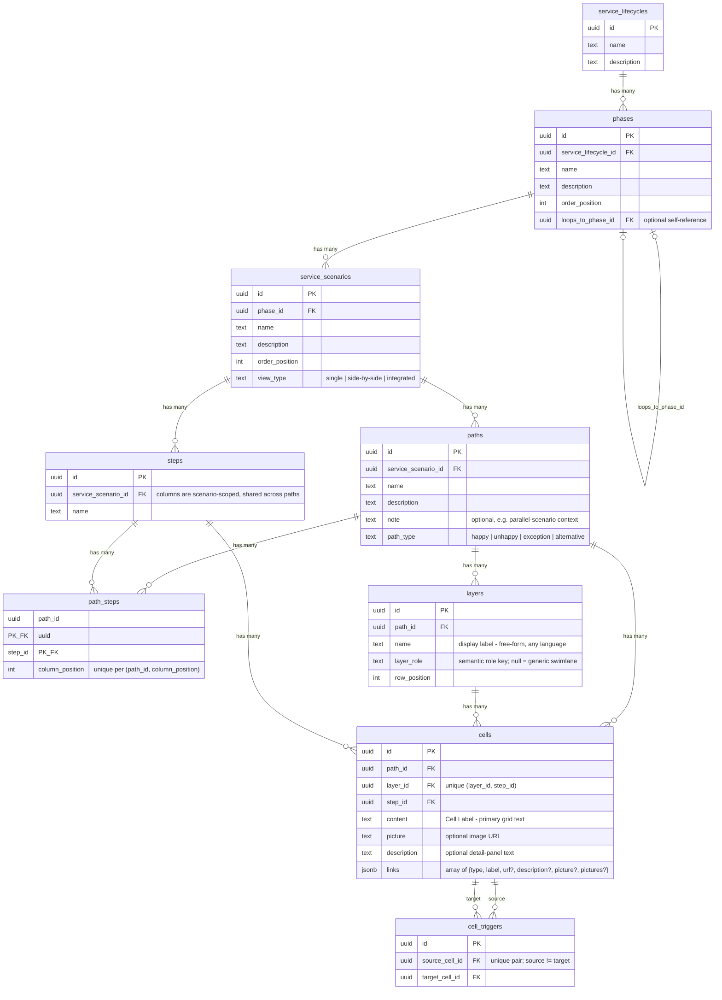

# Data Model

The template's blueprint data model. Source of truth:
`supabase/migrations/20260716200000_template_schema.sql` (snapshot:
`supabase/schema.reference.sql`, diagram: `docs/erd.mmd`). The IR
(`references/ir-schema.json`) mirrors this shape one-to-one with locale maps
and stable keys in place of UUIDs.

## Hierarchy

```
service_lifecycles → phases → service_scenarios → paths → {layers, cells, cell_triggers}
                                                → steps (scenario-scoped)
                                        paths ⇄ steps via path_steps (column order)
```

## ERD



## Tables in brief

| Table | Purpose | Notes |
| --- | --- | --- |
| `service_lifecycles` | Top container (one per blueprint deployment, usually) | |
| `phases` | Lifecycle stages, ordered by `order_position` | `loops_to_phase_id` self-reference renders the lifecycle loop |
| `service_scenarios` | The unit users navigate; owns steps and paths | `view_type` enum below |
| `paths` | A journey variant within a scenario | `path_type` enum below; optional `note` |
| `steps` | Scenario-scoped step columns, SHARED across paths | A step exists once per scenario; paths select/ordr via `path_steps` |
| `path_steps` | Which steps a path uses and in what column order | `column_position` unique per path |
| `layers` | Swimlanes, per PATH (each path carries its own layer rows) | `name` free-form any language; `layer_role` semantic key (see `references/layer-roles.md`) |
| `cells` | Grid content at (layer × step) on a path | `unique (layer_id, step_id)`; `links` JSONB array; `content` newline-separated items render as pills on pill-role lanes |
| `cell_triggers` | Directed arrows cell → cell | Unique pair, `source != target`, both cells must be on the same path |

## Enums

- `service_scenarios.view_type`: `single` \| `side-by-side` \| `integrated`
  - `single`: one path at a time (path picker)
  - `side-by-side`: labeled variant comparison — any two labeled variants
    ("as designed" vs "reality" is just the default labeling)
  - `integrated`: runtime merge of all the scenario's paths into one grid
- `paths.path_type`: `happy` \| `unhappy` \| `exception` \| `alternative`

## Integrity trigger (why import order matters)

The DB trigger `cells_validate_path_match` enforces, on every cell insert:

1. `cells.path_id` must equal its layer's `layers.path_id`, and
2. `(path_id, step_id)` must already exist in `path_steps`.

A cell referencing a step the path never registered **aborts the import
mid-transaction**. This is exactly what `scripts/validate_ir.py` catches
before any adapter runs.

## ⚠ REQUIRED: import order

```
paths → steps → path_steps → layers → cells → cell_triggers
```

(with `service_lifecycles → phases → service_scenarios` before all of the
above). Any other order violates FKs or the integrity trigger.

## Re-import semantics

Scenario-scoped **delete-and-reinsert in one transaction**: delete the
scenario's paths/steps (FK cascades remove path_steps, layers, cells,
triggers), then insert fresh rows in the order above. Never
`on conflict do update` — rows removed from the IR must not survive as
orphans. IDs are UUIDv5 from IR keys + locale (NFC-normalized), so identical
IR re-imports produce identical rows. See `references/adapter-contract.md`.

## Ordering fields

All sibling order is explicit integers: `phases.order_position`,
`service_scenarios.order_position`, `path_steps.column_position` (per path),
`layers.row_position` (per path). The frontend sorts by these — gaps are
harmless, duplicates are not (validator checks).

## Working precedent

`scripts/generate_scale_fixture.mjs` generates the template's sample content
(TS fallback module + `supabase/seed.sql`) from one source of truth with
deterministic IDs and correct insert order — it is the pattern the IR
generators follow.
