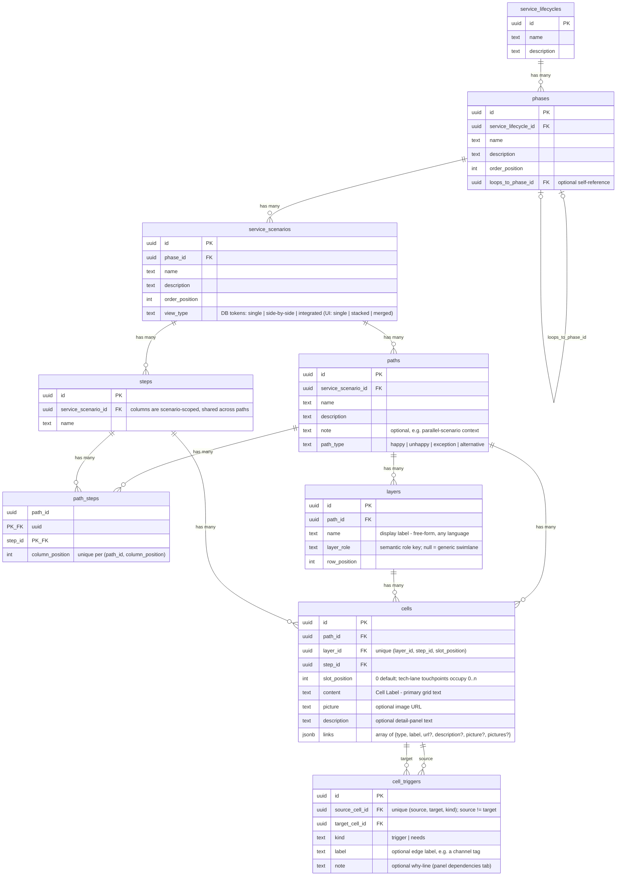

# Data Model

The template's blueprint data model. Source of truth:
`supabase/migrations/20260716200000_template_schema.sql` plus the
derived-layer migrations (`20260729120000_derived_layer.sql`,
`20260730090000_derived_layer_grants_hardening.sql`,
`20260803001000_slices_origin_allows_human.sql`) and the authoring
migrations (`20260818000000_authoring_foundation.sql` — provenance
`origin` columns, `cells.cell_key` identity, `slot_position`,
`deleted_structure`, direct-column grants;
`20260818001000_authoring_operations.sql` — the `SECURITY DEFINER` RPCs
that are the only sanctioned write path for structure;
`20260818002000_service_account_tier.sql` — OPTIONAL recipe splitting
`authenticated` into service/regular tiers via RESTRICTIVE policies;
`20260819000000_agent_surface.sql` — `agent_sessions`/`agent_messages`
chat persistence plus the findings write path for in-app runs) (snapshot:
`supabase/schema.reference.sql`, diagram: `docs/erd.mmd`). The IR
(`references/ir-schema.json`) mirrors this shape one-to-one with locale maps
and stable keys in place of UUIDs.

## Contents

- Hierarchy
- ERD
- Tables in brief
- Enums
- Integrity trigger (why import order matters)
- ⚠ REQUIRED: import order
- Re-import semantics
- Ordering fields
- Working precedent
- Cell slots (`slot_position`)
- Derived layer: slices, findings, evidence, propositions
- Spec fields on IR-owned tables

## Hierarchy

```
service_lifecycles → phases → service_scenarios → paths → {layers, cells, cell_triggers}
                                                → steps (scenario-scoped)
                                        paths ⇄ steps via path_steps (column order)
```

## ERD


```mermaid
erDiagram
  service_lifecycles ||--o{ phases : "has many"
  phases ||--o{ service_scenarios : "has many"
  phases |o--o| phases : "loops_to_phase_id"
  service_scenarios ||--o{ paths : "has many"
  service_scenarios ||--o{ steps : "has many"
  paths ||--o{ path_steps : "has many"
  steps ||--o{ path_steps : "has many"
  paths ||--o{ layers : "has many"
  paths ||--o{ cells : "has many"
  layers ||--o{ cells : "has many"
  steps ||--o{ cells : "has many"
  cells ||--o{ cell_triggers : "source"
  cells ||--o{ cell_triggers : "target"

  service_lifecycles { uuid id PK  text name  text description }
  phases { uuid id PK  uuid service_lifecycle_id FK  text name  text description  int order_position  uuid loops_to_phase_id FK "optional self-reference" }
  service_scenarios { uuid id PK  uuid phase_id FK  text name  text description  int order_position  text view_type "DB tokens: single | side-by-side | integrated (UI: single | stacked | merged)" }
  paths { uuid id PK  uuid service_scenario_id FK  text name  text description  text note "optional, e.g. parallel-scenario context"  text path_type "happy | unhappy | exception | alternative" }
  steps { uuid id PK  uuid service_scenario_id FK "columns are scenario-scoped, shared across paths"  text name }
  path_steps { uuid path_id PK_FK  uuid step_id PK_FK  int column_position "unique per (path_id, column_position)" }
  layers { uuid id PK  uuid path_id FK  text name "display label - free-form, any language"  text layer_role "semantic role key; null = generic swimlane"  int row_position }
  cells { uuid id PK  uuid path_id FK  uuid layer_id FK "unique (layer_id, step_id, slot_position)"  uuid step_id FK  int slot_position "0 default; tech-lane touchpoints occupy 0..n"  text content "Cell Label - primary grid text"  text picture "optional image URL"  text description "optional detail-panel text"  jsonb links "array of {type, label, url?, description?, picture?, pictures?}" }
  cell_triggers { uuid id PK  uuid source_cell_id FK "unique (source, target, kind); source != target"  uuid target_cell_id FK  text kind "trigger | needs"  text label "optional edge label, e.g. a channel tag"  text note "optional why-line (panel dependencies tab)" }
```

## Tables in brief

| Table | Purpose | Notes |
| --- | --- | --- |
| `service_lifecycles` | Top container (one per blueprint deployment, usually) | |
| `phases` | Lifecycle stages, ordered by `order_position` | `loops_to_phase_id` self-reference renders the lifecycle loop |
| `service_scenarios` | The unit users navigate; owns steps and paths | `view_type` enum below |
| `paths` | A journey variant within a scenario | `path_type` enum below; optional `note` |
| `steps` | Scenario-scoped step columns, SHARED across paths | A step exists once per scenario; paths select/ordr via `path_steps` |
| `path_steps` | Which steps a path uses and in what column order | `column_position` unique per path |
| `layers` | Swimlanes, per PATH (each path carries its own layer rows) | `name` free-form any language; `layer_role` semantic key (see `references/layer-roles.md`) |
| `cells` | Grid content at (layer × step) on a path | `unique (layer_id, step_id, slot_position)` (slots below); `links` JSONB array; `content` newline-separated items render as pills on pill-role lanes; spec fields below |
| `cell_triggers` | Directed cell → cell links | `kind` = `trigger` (temporal, canvas arrow) \| `needs` (functional dependency, panel only); optional `label`/`note`; unique `(source_cell_id, target_cell_id, kind)`, `source != target`, both cells on the same path |
| `deleted_structure` | Delete-safety archive: every structural delete's payload, written in the same transaction as the cascade | `kind` (`scenario`\|`path`\|`lane`\|`step`\|`cell`), `label`, `payload` (natural-keyed rows in dependency order for replay-restore), `affected_slices`; readable by app roles, written only by the definer delete RPCs |

## Enums

- `service_scenarios.view_type`: `single` \| `side-by-side` \| `integrated`
  — these are the STORED (DB) tokens; the UI vocabulary is `single` \|
  `stacked` \| `merged`, mapped in `src/lib/viewTypeVocabulary.ts`
  - `single`: one path at a time (path picker)
  - `side-by-side` (UI: "Stacked"): labeled variant comparison — any two
    labeled variants ("as designed" vs "reality" is just the default labeling)
  - `integrated`: legacy value; persisted rows coerce to the plain Stacked
    view on read. The UI's "Merged" canvas (the compared paths drawn as one
    combined blueprint) is session-only and is never written back as
    `integrated`
- `paths.path_type`: `happy` \| `unhappy` \| `exception` \| `alternative`
  — the CHECK constraint allows exactly these four; a labeled variant that
  is none of them is expressed via `variant_label`, not a fifth type
- `cell_triggers.kind`: `trigger` \| `needs` — trigger is temporal (source
  sets off target, renders as a canvas arrow); needs is functional (source
  requires target, renders in the cell panel only)

## Integrity trigger (why import order matters)

The DB trigger `cells_validate_path_match` enforces, on every cell insert:

1. `cells.path_id` must equal its layer's `layers.path_id`, and
2. `(path_id, step_id)` must already exist in `path_steps`.

A cell referencing a step the path never registered **aborts the import
mid-transaction**. This is exactly what `scripts/validate_ir.py` catches
before any adapter runs.

## ⚠ REQUIRED: import order

```
paths → steps → path_steps → layers → cells → cell_triggers
```

(with `service_lifecycles → phases → service_scenarios` before all of the
above). Any other order violates FKs or the integrity trigger.

## Re-import semantics

Scenario-scoped **delete-and-reinsert in one transaction**: delete the
scenario's paths/steps (FK cascades remove path_steps, layers, cells,
triggers), then insert fresh rows in the order above. Never
`on conflict do update` — rows removed from the IR must not survive as
orphans. IDs are UUIDv5 from IR keys + locale (NFC-normalized), so identical
IR re-imports produce identical rows. See `references/adapter-contract.md`.

## Ordering fields

All sibling order is explicit integers: `phases.order_position`,
`service_scenarios.order_position`, `path_steps.column_position` (per path),
`layers.row_position` (per path). The frontend sorts by these — gaps are
harmless, duplicates are not (validator checks).

## Working precedent

`scripts/generate_sample_blueprint.mjs` generates the template's sample content
(TS fallback module + `supabase/seed.sql`) from one source of truth with
deterministic IDs and correct insert order — it is the pattern the IR
generators follow.

## Cell slots (`slot_position`)

`cells.slot_position int not null default 0` is a first-class column
(since `20260818000000_authoring_foundation.sql`): a (lane, step) slot may
hold several cells — one touchpoint per row in tech-role lanes — ordered
by `slot_position`, with uniqueness widened to
`(layer_id, step_id, slot_position)` (constraint
`cells_layer_step_slot_unique`). The slot contract: single-cell slots sit
at 0; tech-lane touchpoints occupy 0..n; the interactive `upsert_cell` RPC
always addresses slot 0, so siblings are created only by dedicated
touchpoint operations (and the migration's one-time split, where the
original row keeps the first item — preserving its id, `cell_key`, arrows,
slice references and evidence — and each further item becomes a sibling
with the parent's key plus an ordinal suffix). Tools and the IR never
expose slot management directly — treat "the" cell of a slot as slot 0.

## Derived layer: slices, findings, evidence, propositions

The skills' outputs land in five derived tables plus one view
(DDL: `supabase/migrations/20260729120000_derived_layer.sql`).
Workspaces provisioned before that migration must route through the
upgrade recipe rather than failing mid-import.

Design invariants: derived tables reference cells SOFTLY — `cell_ids
uuid[]` paired 1:1 with `cell_keys text[]` (IR key-paths for orphan
recovery), no FK — so the importer's scenario-scoped delete-and-reinsert
never cascades into user-authored rows. The hard FK each table does carry
is `service_lifecycle_id` (cascade): lifecycles are upserted, never
deleted, by the importer, and for `evidence` that FK is the
retention/deletion story for interview excerpts.
"Assumption" is a derived state — a cell with zero evidence rows —
deliberately never stored.

| Table | What it is | Notes |
|---|---|---|
| `slices` | A saved 1D cut through the grid that REFERENCES cells (never copies them) | `title`, `description`, `slice_type` (`journey`\|`step`\|`lane`\|`cell`\|`custom`), `actor`, `locale`, `position`, `origin` (`generated` = safe to regenerate \| `customized` = skill output human-edited, regeneration must confirm \| `human` = authored in the app, never the skill's to regenerate) |
| `slice_items` | One frame of a slice | `position` (unique per slice, deferrable), `cell_ids`/`cell_keys` (equal cardinality enforced; empty = title-only divider frame), `caption`, `narrative`, `illustration` JSONB — full-replacement semantics on rework |
| `findings` | One triageable audit/whatif finding | `source` (`audit`\|`whatif`\|`import-sweep`), `check_name`, `severity` (`info`\|`warn`\|`critical`), `note`, `cell_ids`/`cell_keys`, `status` (`open`\|`resolved`\|`dismissed`), `run_id` (FK-less by design — no runs table), `fingerprint` (check_name + sorted-cell_keys hash + reason slug — audit-playbook §2) |
| `evidence` | One provenance row for a cell OR a proposition question | Exactly one of `cell_id` / `proposition_question_key` (`understand`\|`value`\|`usability`); `cell_id` ⇄ `cell_key` always paired; `kind` (`interview`\|`survey`\|`analytics`\|`doc`\|`meeting`\|`decision`\|`observation`\|`other`); `observed_at` is date-only by design (timestamps could re-identify participants); restricted SELECT — excerpts may hold interview content |
| `propositions` | One business-model record per lifecycle (PK = `service_lifecycle_id`) | `funding`, `pricing`, `delivery_cost`, `revenue_model`, `partners`; restricted SELECT |

**Findings dedupe is DB-backed**: the partial unique index
`findings_open_fingerprint_idx` on `(service_lifecycle_id, fingerprint)
where status = 'open'` allows at most one OPEN finding per fingerprint.
Skill-side rule it backstops: open updates in place, dismissed stays
dismissed, resolved reopens as a new row (a reopen collision surfaces as
23505 by design).

**Public count surface**: the `evidence_counts` view (`cell_id → n`)
exposes evidence row counts — never content — to anonymous readers; it
powers the assumption lens on public deploys.

## Spec fields on IR-owned tables

The derived-layer migration also adds human-editable spec columns to
three IR-owned tables (writable via column-scoped grants; the content
columns stay import-owned):

- `cells`: `function` (role/responsibility — what it must do), `form`
  (communication/look/feel — what it must convey), `value_props` (JSONB
  array of `{for, value}`), `owner`, `perceived_owner` (mismatch =
  deception risk)
- `layers`: `owner_team`, `kpis` (string array), `tools` (string array)
- `phases`: `business_impact`, `operational_requirements`
