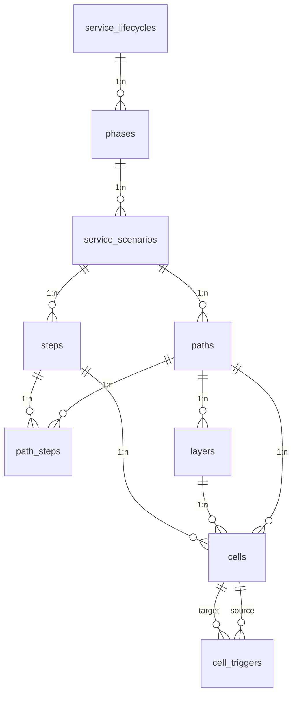

# Database

Postgres database managed by [Supabase](https://supabase.com/) for the **agentic service blueprinting** template.

| Property | Value |
| --- | --- |
| **Engine** | PostgreSQL 17 |
| **Primary schema** | `public` |
| **Migrations** | `supabase/migrations/` (one consolidated schema migration) |
| **Seed data** | `supabase/seed.sql` (generated sample content) |
| **ERD diagram** | `docs/erd.mmd` |
| **DDL snapshot** | `supabase/schema.reference.sql` |
| **TypeScript types** | `src/types/database.ts` |

## Connection (application)

| Variable | Description |
| --- | --- |
| `VITE_SUPABASE_URL` | Project API URL |
| `VITE_SUPABASE_ANON_KEY` | Public anon key (**Settings → API**) |

Without these variables the app runs in **no-DB mode** from the generated
fallback content in `src/data/` — no database required.

## Entity relationship (Service Blueprint)



The full attribute-level ERD (with enums and the `layer_role` vocabulary) is
in [`docs/erd.mmd`](../docs/erd.mmd).

## Hierarchy

| Level | Table | Ordering |
| --- | --- | --- |
| Service Lifecycle | `service_lifecycles` | — |
| Phase | `phases` | `order_position`; optional `loops_to_phase_id` |
| Service Scenario | `service_scenarios` | `order_position`; `view_type` for layout |
| Path | `paths` | `path_type`: happy, unhappy, exception, alternative; optional `note` for path-level context |
| Blueprint row | `layers` | `row_position` (per path); `layer_role` semantic key |
| Blueprint column | `steps` | canonical per `service_scenario` |
| Path column order | `path_steps` | `column_position` per `(path_id, step_id)` |
| Cell | `cells` | unique `(layer_id, step_id)` per path |
| Cell dependency | `cell_triggers` | unique `(source_cell_id, target_cell_id)` |

**Naming note:** DB table `steps` are blueprint **columns** (journey moments), not lifecycle phases. Phases live in `phases`.

**Cascade deletes:** Deleting a lifecycle removes phases, scenarios, paths, layers, steps, path_steps, cells, and triggers. Deleting a phase removes its descendants.

**Path integrity:** `cells.path_id` must match `layers.path_id`, and `cells.step_id` must appear in `path_steps` for that path (trigger `cells_validate_path_match`). Import order: `paths → steps → path_steps → layers → cells → cell_triggers`.

**Shared steps:** Multiple paths under the same scenario can reference the same `steps.id` via `path_steps` with different `column_position` values. See [`docs/scenario-steps-design.md`](../docs/scenario-steps-design.md).

## Layers (`layer_role`)

A layer's display name (`layers.name`) is free-form in any language; the
semantic key `layers.layer_role` drives rendering (pill cells, visual rows,
divider-line anchoring):

| Role | Rendering |
| --- | --- |
| `customer_actions` | Spine actor lane — the **interaction line** draws after it |
| `frontstage_actions`, `frontstage_tech` | Frontstage lanes — the **visibility line** draws after them |
| `backstage_actions` | Backstage lane — the **internal interaction line** draws after it when a `support_systems` lane follows |
| `frontstage_tech`, `backstage_tech`, `support_systems` | Cells render as multi-item **pills** (newline-separated content) |
| `visual`, `step_visual` | Picture rows |
| any other value / `null` | Generic swimlane (actor lanes, org-defined custom roles) |

Frontend contract: `src/lib/layerRoles.ts`.

## Cells

Each cell sits at a **layer × step** intersection for one path.

| Column | Required | Description |
| --- | --- | --- |
| `content` | yes (default `''`) | **Cell Label** — primary text shown in the blueprint grid |
| `picture` | no | Optional image URL or storage reference |
| `description` | no | Optional longer description (detail panel; not the grid label) |
| `links` | no (default `[]`) | JSON array of link objects |

**Links shape** (JSONB array):

```json
[
  { "type": "url", "label": "Runbook", "url": "https://example.com/runbook" },
  {
    "type": "tech_description",
    "label": "Work Order App",
    "description": "Longer copy shown in the tech pill detail panel",
    "picture": "https://example.com/screenshot.png"
  }
]
```

- `type` — `"url"` (external resource) or `"tech_description"` (per-tech copy/pictures for pill lanes)
- `label` — display text; for `tech_description`, must match the pill label in `content`
- `url` / `description` / `picture` / `pictures` — optional payload fields

App types: `CellLink` and `BlueprintCell` in `src/types/blueprint.ts`. Parsing: `normalizeCellLinks()` in `src/lib/cellMetadata.ts`.

## View modes (`service_scenarios.view_type`)

| Value | Behavior |
| --- | --- |
| `single` | One path blueprint at a time |
| `side-by-side` | Compare paths in parallel columns |
| `integrated` | Merge all paths at **runtime** (`mergeIntegratedBlueprint.ts`); each path is still stored separately |

## Sample seed

`supabase/seed.sql` is **generated** by `scripts/generate_scale_fixture.mjs`
alongside the offline fallback module (`src/data/scaleFixture.ts`): one
`Sample Lifecycle` → `Discover`/`Deliver` phases (with a phase loop) → one
`Sample Service` scenario with three paths (happy / alternative / exception),
12 lanes (canonical + custom roles, CJK labels), and 16 shared steps. Sample
UUIDs use the `f0000000-…` prefix. Re-run the generator after editing it —
never edit the emitted files by hand.

## Row Level Security

All blueprint tables have RLS **enabled** with public `SELECT` policies. No
write policies exist — writes go through the Supabase CLI (seeds/migrations)
with your own credentials. **Anything you deploy with an anon key is publicly
readable.**

## Migration history

| File | Description |
| --- | --- |
| `20260716200000_template_schema.sql` | Consolidated template schema: hierarchy + blueprint grid + `layer_role`, integrity trigger, `updated_at` triggers, read-only RLS, legacy `services` cleanup |

## Example query (path blueprint)

```ts
const { data } = await supabase
  .from('paths')
  .select(`
    id,
    name,
    path_type,
    service_scenarios (
      id,
      name,
      phases (
        id,
        name,
        order_position,
        service_lifecycles ( id, name )
      )
    ),
    layers ( id, name, layer_role, row_position ),
    path_steps (
      column_position,
      steps ( id, name )
    ),
    cells (
      id,
      content,
      picture,
      description,
      links,
      layer_id,
      step_id
    )
  `)
  .eq('id', pathId)
  .single()
```

## Key application files

| File | Role |
| --- | --- |
| `src/lib/workflowQueries.ts` | Supabase nested selects |
| `src/lib/normalizeBlueprint.ts` | Raw path row → `BlueprintData` |
| `src/lib/mergeIntegratedBlueprint.ts` | Runtime integrated merge |
| `src/hooks/useScenarioBlueprint.ts` | Load paths + blueprints per scenario |
| `src/data/blueprintFallbacks.ts` | Offline/demo blueprint data |

## Local commands

```bash
npm run supabase:reset          # migrations + seed
npm run supabase:types:local    # regenerate src/types/database.ts
```

## Hosted seed

```bash
supabase db execute --file supabase/seed.sql --linked
```
