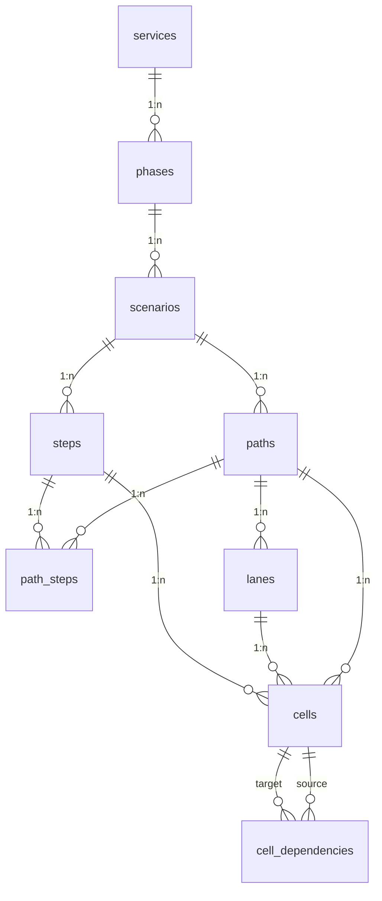

# Database

Postgres database managed by [Supabase](https://supabase.com/) for the **agentic service blueprinting** template.

| Property | Value |
| --- | --- |
| **Engine** | PostgreSQL 17 |
| **Primary schema** | `public` |
| **Migrations** | `supabase/migrations/` (consolidated schema + derived-layer migrations) |
| **Seed data** | `supabase/seed.sql` (generated sample content) |
| **ERD diagram** | `docs/erd.mmd` |
| **DDL snapshot** | `supabase/schema.reference.sql` (its header partitions the portable Postgres core from the Supabase-specific recipe — auth defaults, role grants, RLS, `SECURITY DEFINER`; see also [`references/adapter-contract.md`](../references/adapter-contract.md) § Live backend surface) |
| **TypeScript types** | `src/types/database.ts` |

## Connection (application)

| Variable | Description |
| --- | --- |
| `VITE_SUPABASE_URL` | Project API URL |
| `VITE_SUPABASE_ANON_KEY` | Public anon key (**Settings → API**) |

Without these variables the app runs in **no-DB mode** from the generated
fallback content in `src/data/` — no database required.

## Entity relationship (Service Blueprint)


```mermaid
erDiagram
  services ||--o{ phases : "1:n"
  phases ||--o{ scenarios : "1:n"
  scenarios ||--o{ paths : "1:n"
  scenarios ||--o{ steps : "1:n"
  paths ||--o{ path_steps : "1:n"
  steps ||--o{ path_steps : "1:n"
  paths ||--o{ lanes : "1:n"
  paths ||--o{ cells : "1:n"
  lanes ||--o{ cells : "1:n"
  steps ||--o{ cells : "1:n"
  cells ||--o{ cell_dependencies : "source"
  cells ||--o{ cell_dependencies : "target"
```

The full attribute-level ERD (with enums and the `lane_role` vocabulary) is
in [`docs/erd.mmd`](../docs/erd.mmd).

## Hierarchy

| Level | Table | Ordering |
| --- | --- | --- |
| Service Service | `services` | — |
| Phase | `phases` | `position`; optional `loops_to_phase_id` |
| Service Scenario | `scenarios` | `position`; `view_type` for layout |
| Path | `paths` | `path_type`: happy, unhappy, exception, alternative; optional `note` for path-level context |
| Blueprint row | `lanes` | `position` (per path); `lane_role` semantic key |
| Blueprint column | `steps` | canonical per `scenario` |
| Path column order | `path_steps` | `position` per `(path_id, step_id)` |
| Cell | `cells` | unique `(lane_id, step_id, position)` per path; slot 0 default, tech-lane touchpoints occupy 0..n |
| Cell dependency | `cell_dependencies` | unique `(source_cell_id, target_cell_id, kind)`; `kind`: trigger \| needs |

**Naming note:** DB table `steps` are blueprint **columns** (journey moments), not service phases. Phases live in `phases`.

**Cascade deletes:** Deleting a service removes phases, scenarios, paths, lanes, steps, path_steps, cells, and triggers. Deleting a phase removes its descendants.

**Path integrity:** `cells.path_id` must match `lanes.path_id`, and `cells.step_id` must appear in `path_steps` for that path (trigger `cells_validate_path_match`). Import order: `paths → steps → path_steps → lanes → cells → cell_dependencies`.

**Shared steps:** Multiple paths under the same scenario can reference the same `steps.id` via `path_steps` with different `position` values. See [`references/data-model.md`](../references/data-model.md).

## Lanes (`lane_role`)

A lane's display name (`lanes.name`) is free-form in any language; the
semantic key `lanes.lane_role` drives rendering (pill cells, visual rows,
divider-line anchoring):

| Role | Rendering |
| --- | --- |
| `customer_actions` | Spine actor lane — the **interaction line** draws after it |
| `frontstage_actions`, `frontstage_tech` | Frontstage lanes — the **visibility line** draws after them |
| `backstage_actions` | Backstage lane — the **internal interaction line** draws after it when a `support_systems` lane follows |
| `frontstage_tech`, `backstage_tech`, `support_systems` | Cells render as multi-item **pills** (newline-separated content) |
| `visual`, `step_visual` | Picture rows |
| any other value / `null` | Generic swimlane (actor lanes, org-defined custom roles) |

Frontend contract: `src/lib/laneRoles.ts`.

## Cells

Each cell sits at a **lane × step** intersection for one path.

| Column | Required | Description |
| --- | --- | --- |
| `content` | yes (default `''`) | **Cell Label** — primary text shown in the blueprint grid |
| `picture` | no | Optional image URL or storage reference |
| `summary` | no | Optional longer summary (detail panel; not the grid label) |
| `links` | no (default `[]`) | JSON array of link objects |

**Links shape** (JSONB array):

```json
[
  { "type": "url", "label": "Runbook", "url": "https://example.com/runbook" },
  {
    "type": "tech_description",
    "label": "Work Order App",
    "description": "Longer copy shown in the tech pill detail panel",
    "picture": "https://example.com/screenshot.png"
  }
]
```

- `type` — `"url"` (external resource) or `"tech_description"` (per-tech copy/pictures for pill lanes)
- `label` — display text; for `tech_description`, must match the pill label in `content`
- `url` / `description` / `picture` / `pictures` — optional payload fields

App types: `CellLink` and `BlueprintCell` in `src/types/blueprint.ts`. Parsing: `normalizeCellLinks()` in `src/lib/cellMetadata.ts`.

## View modes (`scenarios.view_type`)

| Value | Behavior |
| --- | --- |
| `single` | One path blueprint at a time |
| `side-by-side` | Labeled variant comparison (UI: "Stacked") |
| `integrated` | **Legacy value** — persisted rows coerce to the plain Stacked view on read (`src/lib/viewTypeVocabulary.ts`). The UI's "Merged" canvas is session-only and never written back as `integrated` |

These are the STORED (DB) tokens; the client vocabulary is `single` \|
`stacked` \| `merged`, mapped at the read/write seams in
`src/lib/viewTypeVocabulary.ts`.

## Sample seed

`supabase/seed.sql` is **generated** by `scripts/generate_sample_blueprint.mjs`
alongside the offline fallback module (`src/data/sampleBlueprint.ts`): one
`Keeping a blueprint true` service → four phases (`Discover` → `Setup` →
`Operate` → `Maintain`, with `Maintain.loops_to_phase_id` → `Operate`) → six
scenarios carrying eight paths (happy / alternative / unhappy) on one 7-lane
roster (canonical + one custom role), plus a visual row
on `Map your service` and three demo slices. Sample UUIDs use the
`f0000000-…` prefix. Re-run the generator after editing it — never edit the
emitted files by hand.

Two things exist in this schema but deliberately not in the sample: `evidence`
rows (restricted `SELECT`, so an offline reader could never see them) and the
lane spec columns `kpis` / `tools` / `owner_team`. Neither has a home in the
offline `BlueprintData` shape, and the seed and the fallback module are
required to hold the same content.

## Row Level Security

All blueprint tables have RLS **enabled** with public `SELECT` policies, and
the `anon` role stays read-only: a deployed site can render everything but
write nothing. **Anything you deploy with an anon key is publicly readable.**

Writes are laneed on top for signed-in sessions (`authenticated`):

- **Structure goes through RPCs, not tables.** The authoring-operations
  migration ships `SECURITY DEFINER` functions (create/duplicate/rename/
  reorder/delete scenarios, paths, lanes, steps; `upsert_cell`;
  dependencies) — each performs one complete, valid edit in one
  transaction. No table-level `INSERT`/`DELETE` on structural tables is
  granted to app roles.
- **Ordinary text edits use column-scoped grants**: `cells.content/
  summary/links`, `lanes.name/lane_role`, `steps.name`,
  `paths.name/summary/note/path_type`,
  `scenarios.name/summary/view_type`, plus the derived-layer
  spec columns — writable directly by `authenticated` under permissive
  update policies.
- **Optional service-account tier** (`20260818002000`, a recipe you can
  skip or delete): RESTRICTIVE policies AND an in-function
  `is_service_account()` guard split `authenticated` into service accounts
  (edit everything) and regular accounts (view + agent surfaces, no
  blueprint writes). `anon` is untouched either way.
- **Agent-surface tables** (`agent_sessions`, `agent_messages`) are
  reachable only by `authenticated`; the same migration restores the
  findings insert/update grants for in-app agent runs (still ANDed with
  the tier's restrictive policies where applied).

Seeds and migrations still go through the Supabase CLI with your own
credentials.

## Migration history

| File | Description |
| --- | --- |
| `20260716200000_template_schema.sql` | Consolidated template schema: hierarchy + blueprint grid + `lane_role`, integrity trigger, `updated_at` triggers, read-only RLS, legacy `services` cleanup |
| `20260729120000_derived_layer.sql` | Derived layer: `slices`, `slice_items`, `findings` (open-fingerprint partial unique index), `evidence`, `propositions`, `evidence_counts` view, cell/lane/phase spec columns, `cell_dependencies.kind` |
| `20260730090000_derived_layer_grants_hardening.sql` | Explicit Data API grants, anon write-privilege revokes, pinned `search_path`, attribution columns, evidence `cell_key` pairing |
| `20260803001000_slices_origin_allows_human.sql` | Adds `human` to the `slices.origin` vocabulary (in-app authored slices) |
| `20260818000000_authoring_foundation.sql` | Authoring foundation: `origin` provenance columns, `cells.cell_key` identity, `cells.position` (+ widened uniqueness), deferrable `path_steps` ordering, `deleted_structure` archive, direct-column grants for panel edits |
| `20260818001000_authoring_operations.sql` | Authoring operations: the `SECURITY DEFINER` RPCs (create/duplicate/rename/reorder/delete structure, `upsert_cell`, dependencies) that are the only sanctioned write path for structural shape |
| `20260818002000_service_account_tier.sql` | OPTIONAL recipe: splits `authenticated` into service accounts (edit everything) and regular accounts (view + agent surfaces) via RESTRICTIVE policies + `is_service_account()` |
| `20260819000000_agent_surface.sql` | Agent surface: `agent_sessions`/`agent_messages` chat persistence (authenticated-only) and the findings insert/update grants for in-app agent runs |
| `21000101000000_schema_version_is_a_table.sql` | `schema_version`: one row naming the shape this database carries, so the adapter contract's compatibility check can interrogate a live target |
| `21000102000000_a_rewriter_for_function_bodies.sql` | Scaffolding for the vocabulary series: rewrites plpgsql bodies a rename left naming the old identifier (restoring ACLs when a signature change forces a drop), renames dependent objects from the catalog, and asserts the old word is gone. Dropped by `21000109000000` |
| `21000103000000_cell_triggers_are_cell_dependencies.sql` | `cell_triggers` → `cell_dependencies`; `kind` keeps (`trigger`, `needs`) |
| `21000104000000_layers_are_lanes.sql` | `layers` → `lanes`, `layers.layer_role` → `lanes.lane_role`, `cells.layer_id` → `cells.lane_id` |
| `21000105000000_position_columns_one_name.sql` | `row_position` · `column_position` · `slot_position` · `order_position` → `position`; `add_lane(at_row)` → `add_lane(at_position)` |
| `21000106000000_service_lifecycles_are_services.sql` | `service_lifecycles` → `services`, `service_lifecycle_id` → `service_id` on phases, slices, findings, evidence, propositions |
| `21000107000000_service_scenarios_are_scenarios.sql` | `service_scenarios` → `scenarios`, `service_scenario_id` → `scenario_id` on paths and steps |
| `21000108000000_description_is_a_summary.sql` | `description` → `summary` on services, phases, scenarios, paths, cells; `slices.description` keeps its name |
| `21000109000000_the_lane_vocabulary_is_a_schema_version.sql` | `schema_version` → `2026.08.25`; drops the series' scaffolding |

## Reserved migration timestamp band

**Upstream migrations are allocated from `21000101000000`–`21991231235959`.
Nothing else is.** Enforced by `npm run check:band`, on every pull request.

The number is an allocation counter wearing a date's clothes. Take the next
unused day in the band; the file's own header carries the date it was really
written.

### Why a band at all

A fork adds `20260901120000_theirs.sql`, then pulls an upstream migration
stamped with the day upstream wrote it. `supabase db push` applies in timestamp
order, so that upstream file sorts *before* a migration the fork has already
applied — the desync people repair by hand-editing
`supabase_migrations.schema_migrations`.

A band above any wall clock a fork will produce makes the ordering arithmetic
instead of procedural: an upstream migration always sorts after everything the
fork has applied, so a pull can only ever append. In exchange, upstream
migrations must never assume anything a fork built — which is already true of
every migration here, and is now a rule rather than a coincidence.

### The eight that predate the rule

`20260716200000` through `20260819000000` keep their real timestamps. They are
already applied on every database that exists, and renaming an applied migration
*is* the desync this prevents. `scripts/check-migration-band.mjs` freezes them by
name; that list only ever shrinks.

### Adding a migration

1. Take the next unused day inside the band — one migration per day, in order.
   Use the time field when several land in one release.
2. Write the real authoring date in the file header.
3. `npm run check:band`.

## Migration authoring notes

Ops lessons this repo carries as rules for anyone adding migrations:

- **REVOKE from PUBLIC on every new write function.** Postgres grants
  `EXECUTE` to `PUBLIC` on function creation, so a freshly created
  `SECURITY DEFINER` RPC is callable by every role until you say
  otherwise. Pair every `create function` with
  `revoke execute ... from public, anon;` and an explicit `grant execute`
  to the roles that should call it — in the same migration.
- **Migration files are committed the same day they are applied** to any
  shared project. An applied-but-uncommitted migration makes the repo lie
  about the shared schema; the next contributor's `db reset` or diff runs
  against a state the migrations directory cannot reproduce.
- **Undo paths couple to insert policies.** Migrations are append-only
  (an undo is a new migration), and client-side undo is policy-coupled: a
  revert that re-inserts a deleted row verbatim (evidence restore is the
  canonical case) works only while the table's INSERT policy accepts
  client-supplied ids and authorship columns. Tightening that policy —
  e.g. adding `with check (created_by = auth.uid())` — silently breaks
  the undo. If the policy must tighten, move the restore into a
  `SECURITY DEFINER` RPC that re-checks authorization and preserves
  authorship server-side, in the same change.
- **RESTRICTIVE policies never bind SECURITY DEFINER RPCs.** Definer
  functions run as the function owner and bypass RLS entirely, so a
  restrictive tier policy on the table gives zero protection against
  them. The guard must be asserted inside the function body — an
  `is_service_account()`-style check raising an exception — in every
  definer RPC that writes.

## Example query (path blueprint)

```ts
const { data } = await supabase
  .from('paths')
  .select(`
    id,
    name,
    path_type,
    scenarios (
      id,
      name,
      phases (
        id,
        name,
        position,
        services ( id, name )
      )
    ),
    lanes ( id, name, lane_role, position ),
    path_steps (
      position,
      steps ( id, name )
    ),
    cells (
      id,
      content,
      picture,
      summary,
      links,
      lane_id,
      step_id
    )
  `)
  .eq('id', pathId)
  .single()
```

## Key application files

| File | Role |
| --- | --- |
| `src/lib/workflowQueries.ts` | Supabase nested selects |
| `src/lib/normalizeBlueprint.ts` | Raw path row → `BlueprintData` |
| `src/lib/viewTypeVocabulary.ts` | DB ⇄ client view-type token maps (`integrated` → stacked on read) |
| `src/hooks/useScenarioBlueprint.ts` | Load paths + blueprints per scenario |
| `src/data/blueprintFallbacks.ts` | Offline/demo blueprint data |

## Local commands

```bash
npm run supabase:reset          # migrations + seed
npm run supabase:types:local    # regenerate src/types/database.ts
```

## Hosted seed

```bash
supabase db execute --file supabase/seed.sql --linked
```
